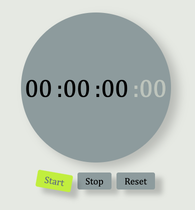

<!-- Encabezado y título del proyecto -->
<h1 align="center">
   
  Timer Increíble 🚀
</h1>

<!-- Descripción del proyecto -->

  ¡Un para ayudarte a administrar tu tiempo de manera eficiente! ⏰

<!-- Demo y capturas de pantalla -->

  

<!-- Badges -->
<!-- 

  
  
  

 -->

<!-- Características y funcionalidades -->
## Características ✨

- Inicia, pausa y reinicia el timer con un solo clic.
<!-- - Cuenta regresivamente desde un tiempo personalizable.
- Muestra notificaciones divertidas cuando el tiempo se agota. -->

<!-- Tecnologías utilizadas -->
## Tecnologías utilizadas 🛠️

- HTML
- CSS
- JavaScript

<!-- Instalación y uso -->
## Instalación y uso 🚀

1. Clona este repositorio: `git clone https://github.com/tu-usuario/tu-repo.git`
2. Abre el archivo `index.html` en tu navegador favorito.
3. ¡Listo! Comienza a utilizar el timer y administra tu tiempo de manera efectiva.

<!-- Contribución -->
## Contribución 🤝

¡Las contribuciones son bienvenidas! Si tienes alguna idea o mejora, siéntete libre de abrir un issue o enviar un pull request. Juntos podemos hacer que el timer sea aún mejor.

<!-- Agradecimientos -->
## Agradecimientos ❤️

¡Gracias por visitar este proyecto! Espero que encuentres útil este timer. Si tienes alguna pregunta o comentario, no dudes en contactarme.

¡Diviértete administrando tu tiempo! 😄
